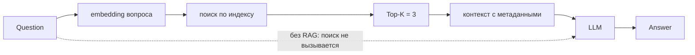

# День 22. RAG-агент: два режима и сравнение на контрольных вопросах — устройство

День 22 надстраивает над индексом дня 21 агента: вопрос уходит в embedding, найденные фрагменты
собираются в контекст, модель отвечает по ним — и то же самое происходит без поиска, чтобы разницу
можно было посчитать, а не почувствовать. Сравнение идёт на десяти контрольных вопросах с заранее
записанными ожиданиями, поэтому «стало лучше» здесь — это средняя оценка по шкале 0–2, попадание
ожидаемого источника в Top-K и два разных вида ошибок, а не мнение о двух ответах.

Модуль — `:rag` (Kotlin/JVM). Точка входа — `RagCli`, отчёт целиком печатает
`./gradlew :rag:ragDemo -Pdemo.live=1`; тот же прогон сохраняется в `build/rag/report.md`
(сравнение) и `build/rag/log.md` (путь запроса). Живая страница с теми же вопросами и обоими
конвейерами — модуль `:rag-ui` (`./gradlew :rag-ui:run`, http://127.0.0.1:8098), её отчёты лежат
в `build/rag-ui/`.

## 1. Что просит задание и чем подтверждается

| Требование | Где сделано | Чем подтверждается |
| --- | --- | --- |
| Путь Question → Retrieval → Top-K → Context → LLM → Answer | `Retriever`, `Prompt.fragments`, `RagAgent`, `Report.log` | `log.md`: по каждому вопросу — выдача поиска целиком, контекст, ушедший в запрос, и ответ |
| Вопрос превращается в embedding | `Retriever.retrieve` → `EmbeddingProvider` | в логе у вопроса стоит размерность вектора (`вектор вопроса: 1024`), он же в `Retrieval.queryVector` |
| Индекс дня 21, без переиндексации на каждый запрос | `RagIndex` (`file = index-structural.json`, `exists`), `Corpus`, `DocumentIndexer` из `:indexing` | шапка прогона: «индекс взят готовым» + число чанков; `--rebuild` собирает индекс заново и только тогда показывается время сборки |
| Top-K = 3 | `RagCli.DEFAULT_TOP_K`, `RagSession.DEFAULT_TOP_K` | шапка отчёта («Фрагментов в запрос: 3») и лог: у каждого вопроса три фрагмента; `--topK=`, `?topK=` меняют число |
| Контекст с метаданными источников | `Source.label` (`book.md · стр. 8 · Глава первая · чанк #12`) | лог: подпись стоит перед текстом каждого фрагмента, её же видит модель |
| Два режима агента: с RAG и без | `Agent.Mode`, `RagAgent.answer` | таблица сравнения: обе колонки на каждом вопросе, оба ответа целиком в `report.md` |
| 10 контрольных вопросов с фиксированными ожиданиями | `Controls.questions` | `ControlsTest` (2 проверки: факты лежат на объявленных страницах, признаков отказа нет в корпусе), таблица вопросов в отчёте |
| Минимум один вопрос без ответа в базе | `q10` (`ControlQuestion.absent`, `pages` пуст) | `ControlsTest`: у вопроса нет страниц, а признаков отказа нет в тексте корпуса |
| Оценка ответа 0–2 в обоих режимах | `AnswerCheck.score`, `Summary.averageWith/averageWithout` | колонки «без RAG» и «с RAG» в отчёте, средние в итоговых метриках |
| Оценка retrieval 0/1 | `AnswerCheck.retrievedFacts`, `Summary.hits/scored/hitRate` | колонка «источник» (✓/—) и Source Hit Rate в метриках |
| Ошибки разделены на поисковые и генеративные | `Check.outcome`, `Outcome` | колонка «итог» и счётчики ошибок в метриках |
| Метрики: средние оценки, Source Hit Rate | `Summary`, `Report.totals` | раздел «Итоговые метрики» в `report.md` и в консоли |
| Similarity сохраняется, но не основная метрика | `Source.similarity`, `SearchResult` из `:indexing` | близость у каждого фрагмента в логе; в метрики она не входит |
| Логирование пути запроса | `Report.log` | `build/rag/log.md` |

`./gradlew :rag:test` — 19 проверок (`PromptTest`, `CheckTest`, `RagAgentTest`, `ControlsTest`),
`./gradlew :rag-ui:test` — 2 (`RagSessionTest`).

## 2. База и индекс: корпус дня 21, без переиндексации

База дня 22 — тот же корпус, что у страницы дня 21: встроенный PDF романа «Бесы», страницы 1–40
(`DayCorpus.PAGES`), разобранный тем же `PdfSource` в тот же файл `book.md`. Отдельного текста для
дня 22 не заводится: вторая копия книги разошлась бы с первой, и сравнение отвечало бы на вопрос
«где в копии», а не «где в файле». Корпус читает `Corpus.read` — он берёт готовый файл из рабочего
каталога, а если файла нет, разбирает PDF; в обоих случаях страницы восстанавливаются из маркеров
`<!-- page:N -->` (`PageMarkers.stripAndIndex`), поэтому номера страниц в чанках — физические
страницы PDF, как и в дне 21.

Индекс дня 22 — свой файл (`build/rag/index-structural.json`), собранный тем же конвейером
(`DocumentIndexer` + `StructuralChunker` + провайдер векторов) и только если его нет (`RagIndex.exists`).
Это и есть «не переиндексировать при каждом запросе»: 61 чанк корпуса считаются один раз, дальше
прогон их только читает. `--rebuild` (кнопка «Собрать индекс» на странице) пересобирает индекс
принудительно — например, после смены модели векторов, потому что размерность вектора часть данных
индекса, и индекс, собранный одной моделью, другой не ищется.

Индекс страницы дня 21 (`build/index-ui/...`) входом не служит: там два индекса двух стратегий
своего эксперимента, и день 22 не должен зависеть от того, прогоняли ли его. Одинаков у них не
файл, а конвейер.

## 3. Десять контрольных вопросов: что они проверяют и почему такие

| # | Вопрос | Ответ в базе | Зачем в наборе |
| --- | --- | --- | --- |
| q01 | Что осталось у Степана Трофимовича после смерти первой жены? | стр. 8, Глава первая | событие известно, подробности — нет |
| q02 | Какой предмет с серебряным набалдашником входил в его костюм? | стр. 13, Глава первая | деталь быта: есть только в тексте |
| q03 | Сколько раз в жизни он видел своего сына? | стр. 17, Глава первая | число плюс обстоятельство |
| q04 | Кем приходится Дарья Павловна Шатову? | стр. 19, Глава первая | отношения второстепенных лиц |
| q05 | Что Виргинский сделал с Лебедкиным в роще? | стр. 21, Глава первая | сцена из нескольких предложений |
| q06 | Чем Лямшин развлекал гостей, помимо фортепиано? | стр. 22, Глава первая | гротескная деталь эпизода |
| q07 | Как Николай Всеволодович оскорбил старшину в клубе? | стр. 28, Глава вторая | эпизод известен, способ — нет |
| q08 | Как часто Липутин созывал гостей к себе? | стр. 30, Глава вторая | подробность этого текста |
| q09 | Какая книга стояла на самом видном месте у Липутина? | стр. 33, Глава вторая | имя из книги; при Top-K = 3 ответ в выдачу не попадает — готовая поисковая ошибка |
| q10 | Чем закончилась история Петра Степановича Верховенского? | ответа в базе нет | проверка поведения: признать нехватку сведений вместо ответа по памяти |

Правил подбора четыре. **Проверяемость**: у каждого вопроса есть место в корпусе, и оно подтверждено
`ControlsTest` — ожидаемые слова лежат на объявленных страницах, а не «где-то в романе»; вопросы
вида «почему герой так поступил» превратили бы сравнение в оценку рассуждений. **Разнообразие мест**:
страницы 8–33, обе главы среза, разные лица — иначе набор мерил бы один участок текста.
**Разная достижимость памятью модели**: часть вопросов о том, что о романе известно вообще (кто
кому сестра), часть — о подробностях именно этого текста (сколько раз, какая книга стояла на столе);
на вторых и видно, что даёт база. **Разные типы ожидания**: числа, имена, отношения, деталь быта
и одна сцена из нескольких предложений.

Ни один вопрос не дублирует свой ответ: у вопроса, в который вписан ответ, режим без RAG показал бы
только умение повторить вопрос. Формулировки — как у человека, который книгу читал, но подробностей
не помнит.

Два вопроса стоят отдельно, и оба — про поведение, а не про знание. **q09** специально оставлен там,
где поиск до ответа не доходит: нужный чанк четвёртый по близости, при Top-K = 3 он в выдачу
не попадает, и это готовый пример поисковой ошибки — модель не могла ответить верно, потому что
верного текста ей не дали. **q10** — вопрос без ответа в базе
(`ControlQuestion.absent`): срез кончается на первых главах, дальнейшая судьба Петра Степановича
в него не входит, и правильным поведением считается сказать, что во фрагментах этих сведений нет.
В оценке поиска такой вопрос не участвует: считать «источник не найден» ошибкой там, где источника
нет, значило бы наказывать поиск за верное поведение.

## 4. Два режима: одна модель, разница — фрагменты в промпте

Оба режима идут через один `RagAgent` и один и тот же клиент модели, с одинаковыми
`temperature = 0.0` и `maxTokens = 8192`. Различаются ровно две вещи: блок фрагментов в
пользовательском сообщении и системное правило о том, как с ними обращаться. Общая часть
(`Prompt.TASK` — «отвечай кратко, три–пять предложений, своими словами» — и `Prompt.QUESTION_PREFIX`)
лежит одной константой, и оба режима берут её оттуда: правка в одном месте не может разойтись
с другим, иначе сравнение мерило бы разницу промптов, а не пользу поиска.

Режим с RAG получает три правила: опираться только на фрагменты и не дополнять их тем, что модель
помнит о романе; если ответа во фрагментах нет — сказать об этом прямо; назвать номера фрагментов
и страницы. Первое правило — то, ради чего режим существует: без него модель дописывает ответ
по памяти, и режим с RAG перестаёт отличаться от режима без RAG. Второе делает проверяемым q10:
признание нехватки сведений — это наблюдаемое поведение, а не молчание.

Режим без RAG поиск не вызывает вовсе — не «вызывает и не подставляет»: `RagAgent` держит
`SourceFinder` и в этом режиме к нему не обращается, поэтому в его `Answer` пустая выдача и нулевое
время поиска. Это проверяется тестом на источнике, который падает при любом обращении: если бы
режим без RAG его дёрнул, тест упал бы.

Фрагменты уходят в контекст целиком, а не выжимкой из предложений: выжимка отбирает предложения
по словам вопроса и может выбросить именно тот ответ, который в чанке есть. Три фрагмента задания —
это около двух с половиной тысяч токенов при бюджете ответа, который задаёт прогон, и экономить
здесь нечего.

## 5. Поиск: Top-K = 3, similarity как число выдачи, а не как метрика

Поиск — тонкая обёртка над днём 21: `Retriever` считает вектор вопроса тем же провайдером, что
индексировал корпус, и просит у `JsonVectorStore.search` ближайшие чанки. Наружу он отдаёт
`Retrieval` — выдача плюс вектор вопроса и время поиска, — а `Source` несёт ранг, близость, текст
и метаданные чанка (`source`, `title`, `pages`, `section`, `chunkIndex`). Метаданные здесь не
украшение: подпись `book.md · стр. 8 · Глава первая · чанк #12` уходит в контекст, по ней модель
называет источник, и по ней же отчёт связывает названное со страницами.

Близость сохраняется и печатается у каждого фрагмента в логе, но метрикой качества не является.
Причина простая: у косинуса нет порога, за которым начинается «правильный» ответ, — на однородном
тексте одной книги близости сжимаются в узкий диапазон, а короткий чанк с теми же словами получает
близость выше длинного. Поэтому попадание источника считается по содержимому
(`AnswerCheck.retrievedFacts`: есть ли в найденных фрагментах текст ожидания, а не близость
и не номер страницы), а близость остаётся тем, чем она полезна, — числом выдачи, по которому видно
порядок.

Индекс дня 21 — тот же, что у страницы дня 21 по устройству, но не по файлу: день 22 собирает свой
(`index-structural.json`) и переиспользует его между прогонами. `RagIndex` открывает файл через
`open` и читает чанки с диска, поэтому поиск идёт по сохранённым данным, а не по памяти прогона.

## 6. Оценка 0–2: факты, а не формулировка

Оценка считается не по сходству с эталоном и не по общему впечатлению, а по фактам: у вопроса
перечислено, что должно быть в правильном ответе (`Fact`), у каждого факта — признаки, по которым
он засчитывается. 0 — ответа нет или он неверен, 1 — правильный, но неполный (часть фактов),
2 — все факты на месте. У вопроса без фактов оценки не существует; у вопроса с двумя 1 балл
означает «сказал половину», поэтому в отчёте рядом с оценкой всегда стоят факты («1 из 2» читается,
«1» — нет).

Признак — основа слова или словосочетание, а не строка целиком: ответ «тростью» и ответ «трость» —
про одно и то же, и требовать формулировку значило бы проверять слог. Сопоставление идёт по
нормализованному тексту (регистр, «ё», знаки препинания снимаются), словосочетание ищется
подстрокой, слово — по началу словоформы. Список признаков ведётся руками и остаётся неполным
по построению: синоним, которого в нём нет, проверка не засчитает, и это видно в отчёте как
незасчитанный факт, а не как молчаливая ошибка.

Отдельно от фактов разбираются ссылки: номера фрагментов в квадратных скобках и страницы словами
(«стр. 8», «стр. 8–9»). Это разные утверждения — ответ может содержать факт и не ссылаться
на источник, а может ссылаться и не содержать факта, — и считать их одним числом значило бы
потерять, что именно сделала модель: прочитала или вспомнила. Чужие номера фрагментов (такого
фрагмента в выдаче не было) отбрасываются: это ошибка в ответе, а не ссылка на базу.

## 7. Ошибки: поисковая, генеративная и вопрос без ответа

Итог вопроса — одно из трёх: верно, ошибка поиска, ошибка генерации. Разделение нужно потому, что
«ответ неверный» не говорит, что улучшать: если нужного текста в выдаче не было вовсе, виноват
поиск, и никакая модель ответить правильно не могла; если текст был, а ответ всё равно неполный —
не справилась модель.

Порядок проверок в `Check.outcome` намеренный: **сначала поиск**. Верным считается только ответ,
и сошедшийся с ожиданием, и подкреплённый найденным текстом; правильный ответ по памяти при пустой
выдаче закрывается как поисковая ошибка, потому что заданию нужно знать, что база не сработала,
а не то, что модель угадала. Для вопроса без ответа в базе поиска нет вовсе: там ошибка генерации —
это ответ по памяти, потому что правильным поведением было признать нехватку сведений.

## 8. Метрики прогона

Итог считает `Report.summary` — одно место на оба входа (консоль и страница), чтобы формулы
не разошлись:

- **средняя оценка каждого режима** (`averageWithout`, `averageWith`) по шкале 0–2;
- **Source Hit Rate** (`hits` из `scored`): у скольких вопросов, у которых ответ в базе есть,
  ожидаемый текст попал в Top-K. Вопрос без ответа в базе в знаменатель не входит — иначе поиск
  наказывался бы за верное поведение;
- **счёт по вопросам** (`better`/`same`/`worse`): где режим с базой отыграл, где сравнялся, где
  потерял;
- **исходы** (`answered`, `retrievalErrors`, `generationErrors`);
- **факты** (`factsWith`, `factsWithout`, `factsTotal`) — по ним видно, что средняя оценка считается
  по вопросам, а «сколько фактов нашлось» по фактам;
- **токены** (`TokensUsed`: что насчитал API и у скольких ответов он его сообщил) и **время**
  (ответы в обоих режимах и поиск отдельно).

Similarity в этот список не входит: она печатается у каждого фрагмента в логе как число выдачи
(§5), и на её место в метриках претендует попадание источника.

## 9. Путь запроса в логе: Question → Retrieval → Top-K → Context → LLM → Answer

`log.md` пишется затем, чтобы путь запроса можно было разобрать после прогона: контекст уходит
вместе с процессом, и собрать его заново нельзя. У каждого вопроса в логе по шагам:

1. **Question** — номер, вопрос, эталонный ответ, ожидаемые страницы и факты;
2. **Retrieval** — размерность вектора вопроса и время поиска;
3. **Top-K** — выдача целиком: ранг, близость, идентификатор чанка, страницы, раздел и текст
   каждого найденного фрагмента (и то же для режима без RAG — пустая выдача и «поиск не вызывался»);
4. **Context** — то, что увидела модель: системное сообщение и пользовательское сообщение с
   фрагментами дословно;
5. **LLM** — модель, время, токены, причина остановки;
6. **Answer** — ответ целиком и сверка: засчитанные факты, ссылки на фрагменты и страницы,
   оценка.

В том же файле — шапка прогона (модель, провайдер векторов, стратегия нарезки, Top-K, размер
корпуса, число чанков, был ли индекс собран заново). Отчёт `report.md` — другой взгляд на тот же
прогон: таблица оценок и ответы целиком, без промежуточных шагов.

## 10. Интерфейс: десять вопросов и два конвейера

Страница дня 22 (`:rag-ui`, порт 8098, рабочий каталог `build/rag-ui`) показывает то же сравнение,
что консоль, но по шагам. На ней: корпус дня (файл, размеры, страницы), состояние индекса и кнопка
его сборки, таблица десяти вопросов с галочками, поле Top-K и кнопка запуска. Прогон идёт в фоне,
страница опрашивает состояние и показывает прогресс; один прогон за раз — второй запуск получает
отказ с причиной, а не портит первый.

Результат по каждому вопросу — два конвейера рядом, по звеньям: вопрос → вектор → поиск → Top-K →
контекст → модель → ответ → сверка. В колонке без RAG звено поиска честно говорит, что поиска
не было, а не показывает пустые страницы. Под конвейерами — промежуточные результаты (вектор
вопроса и его размерность, время поиска, найденные фрагменты с близостью, страницами и разделом,
сообщения, ушедшие в модель, названные фрагменты и страницы) и конечный результат: ответ, сверка
фактов («засчитано N из M») и оценка. Метрики на странице не пересчитываются — она показывает те
же числа, что посчитал `Report.summary`, поэтому расхождения между страницей и отчётом быть
не может.

Сервер умеет четыре запроса: `/api/setup` (что известно до нажатия), `/api/state` (состояние
прогона), `/api/run?ids=q01,q02&topK=3` (пустой `ids` — все десять вопросов) и `/api/index`
(пересборка индекса, доступна и без ключа модели — эмбеддинги локальные). После каждого вопроса
страница переписывает свои `report.md` и `log.md`, поэтому отчёт есть и без консольного прогона.

## 11. Результаты прогона

`./gradlew :rag:ragDemo -Pdemo.live=1`, 2026-10-07: база — `book.md`, 121 945 символов,
18 980 токенов, 39 страниц, индекс `structural` — 61 чанк, векторы `bge-m3`, поиск Top-3,
модель `deepseek-v4-flash`. Индекс собран этим прогоном за 6,4 с; дальше он берётся готовым,
и переиндексации при запросе нет.

| # | вопрос | без RAG | с RAG | источник | итог |
| --- | --- | --- | --- | --- | --- |
| q01 | Что осталось у Степана Трофимовича после смерти первой жены | 0 / 2 | 2 / 2 | да | верно |
| q02 | Предмет с серебряным набалдашником в костюме | 1 / 2 | 1 / 2 | да | ошибка генерации |
| q03 | Сколько раз он видел сына | 1 / 2 | 2 / 2 | да | верно |
| q04 | Кем приходится Дарья Павловна Шатову | 1 / 2 | 2 / 2 | да | верно |
| q05 | Что Виргинский сделал с Лебедкиным в роще | 0 / 2 | 2 / 2 | да | верно |
| q06 | Чем Лямшин развлекал гостей | 0 / 2 | 2 / 2 | да | верно |
| q07 | Как оскорбили старшину в клубе | 1 / 2 | 2 / 2 | да | верно |
| q08 | Как часто Липутин созывал гостей | 0 / 2 | 2 / 2 | да | верно |
| q09 | Какая книга стояла у Липутина на виду | 0 / 2 | 0 / 2 | нет | ошибка поиска |
| q10 | Чем закончилась история Петра Степановича | 0 / 1 | 2 / 1 | — | верно |

Итоговые метрики прогона:

- средняя оценка **без RAG — 0,4 из 2** (4 из 19 фактов), **с RAG — 1,7 из 2** (16 из 19 фактов);
- **Source Hit Rate (Top-3) — 8 из 9 (88 %)**; вопрос без ответа в базе в знаменатель не входит;
- по вопросам: с RAG выше в 8, столько же в 2, ниже в 0;
- итог: **верно 8, ошибок поиска 1, ошибок генерации 1**;
- токены: без RAG 982 + 27 949 (запрос + ответ), с RAG 23 820 + 2 460;
- время: без RAG 150,7 с, с RAG 18,9 с, из них поиск 0,5 с.

Что тут видно по отдельным вопросам. **q01** — пример того, ради чего база вообще нужна: без неё
модель не назвала ни одного факта (0 из 2), с ней назвала оба. **q02** — единственная генеративная
ошибка прогона: нужный текст в Top-K был (источник «да»), а ответ содержал половину фактов —
ошибка не поиска, а модели. **q09** — единственная поисковая ошибка, и она ожидаемая: ответ лежит
в четвёртом по близости чанке, при Top-K = 3 в выдачу он не попадает, поэтому оба режима получили
0 — и это не про модель, а про поиск. **q10** — вопрос без ответа в базе: без RAG модель уверенно
рассказала судьбу Петра Степановича по памяти (смерть Шатова, самоубийство Кириллова, отъезд
за границу — всё это дальше среза) и получила 0; с RAG ответила «в приведённых фрагментах ответа
на этот вопрос нет… в них речь идёт не о Петре Степановиче, а о его отце» и получила 2. Это и есть
проверяемое поведение, ради которого в промпте стоит правило не дополнять фрагменты памятью.

**Прогон через страницу** (`:rag-ui`, все десять вопросов, те же база, индекс, Top-K и модель,
прогон целиком 208,7 с) дал близкие, но не совпадающие числа: средняя без RAG 0,5 из 2 (5 из 19
фактов), с RAG 1,5 из 2 (14 из 19), Source Hit Rate 8 из 9 (89 %), по вопросам +7 / =3 / −0, верно 6,
ошибок поиска 1, ошибок генерации 3, токены 34 714 / 26 129, время 181,6 с и 19,8 с (поиск 0,55 с).
Расхождение ожидаемо и о сравнении ничего не портит: `temperature = 0.0` снижает разброс, но
не делает сервер детерминированным — ответы двух прогонов на один вопрос отличаются формулировкой,
а значит и засчитанными фактами (в этом прогоне, например, q01 с RAG набрал 1 балл вместо 2).
Вывод от прогона к прогону не меняется: направление и величина разрыва те же, оба раза ни одного
вопроса, где с базой хуже. Отчёты страницы — `build/rag-ui/report.md` и `build/rag-ui/log.md`.

## 12. Вывод

По числам прогона RAG-надстройка над индексом дня 21 делает ровно то, за чем её ставят: средняя
оценка растёт с 0,4 до 1,7 из 2, фактов засчитано 16 из 19 против 4 из 19, а на восьми вопросах
из десяти ответ с базой лучше — и ни на одном не хуже. Память модели на этом корпусе отвечает
в лучшем случае наполовину (числа и детали сцены она не воспроизводит), чтение найденного текста —
в основном полностью.

Не всё в этих числах про пользу базы, и это видно по разделению ошибок. Одна ошибка из десяти —
поисковая (**q09**): нужный чанк четвёртый по близости, при Top-K = 3 он не доходит до модели,
и оба режима получают 0. Ответа тут не знала бы и идеальная генерация — лечится это поиском
(другая нарезка, больший Top-K), а не промптом. Одна ошибка — генеративная (**q02**): текст был
в выдаче, а модель назвала половину фактов; тут не хватило чтения. Разные болезни — разные
лекарства, и ради этого разделения и считается «источник» отдельно от оценки ответа.

Отдельно стоит **q10**, и он показывает то, что средними не измеряется. Ответа в базе нет —
срез кончается на первых главах романа. Без RAG модель ответила по памяти и уверенно: смерть
Шатова, самоубийство Кириллова, отъезд за границу. С RAG она сказала, что в найденных фрагментах
этого нет, и назвала, о ком в них речь. Это не «плюс балл к средней» — это разница между агентом,
которому можно верить на этом корпусе, и агентом, который дописывает книгу по воспоминаниям;
правило промпта «не дополняй фрагменты тем, что помнишь» — единственная причина, по которой второе
поведение вообще наблюдаемо.

Similarity в этой картине не метрика и метрикой не притворяется: близости в логе (0,45–0,51
на q10) показывают только порядок выдачи, а качество меряется попаданием ожидаемого текста
в Top-K и засчитанными фактами. Так и задумано: у косинуса нет порога, за которым начинается
«правильный» ответ.

Границ у этого прогона три, и все три — границы базы, а не кода. Первая: база — срез страниц 1–40,
поэтому вопросы набора живут внутри него (и один вопрос специально задан вне среза). Вторая:
набор из десяти вопросов — не статистика: шаг в один балл на вопросе с двумя фактами это половина
вопроса, и «+1,3 балла» здесь означает «в основном стал называть оба факта», а не измеренную
величину с точностью до десятых. Третья: `temperature = 0.0` не даёт детерминизма — два прогона
одного набора дали 1,7 и 1,5 средней с RAG, и расхождение объясняется формулировками ответов,
а не работой поиска (выдача при этом одна и та же: Source Hit Rate 8 из 9 в обоих прогонах).

## 13. Как запускать

- **Сравнение в консоли** — `./gradlew :rag:ragDemo` печатает подсказку, что нужен флаг;
  `./gradlew :rag:ragDemo -Pdemo.live=1` делает 20 запросов к модели (десять вопросов в двух
  режимах) и пишет `build/rag/report.md` и `build/rag/log.md`.
  Параметры: `--args="--only=q09 --topK=5 --strategy=fixed --rebuild"`.
- **Страница** — `./gradlew :rag-ui:run`, http://127.0.0.1:8098; порт и каталог задаются
  `RAG_UI_PORT` и `RAG_UI_DIR`.
- **Проверки** — `./gradlew :rag:test` (19 проверок: промпты, проверка фактов и исходов, агент,
  сами вопросы) и `./gradlew :rag-ui:test` (2: прогон сессии на подставном клиенте модели).
- **Ключ модели** — `DEEPSEEK_API_KEY` в окружении или в `server/.env`; без него отчёт скажет,
  чего не хватает, а страница покажет поиск без ответов модели.
- **Векторы** — демон Ollama на `127.0.0.1:11434` (`brew services start ollama`, `ollama pull bge-m3`);
  выбор провайдера — окружением, как в дне 21 (`INDEXING_EMBEDDING`, `INDEXING_OLLAMA_URL`,
  `INDEXING_OLLAMA_MODEL`).
